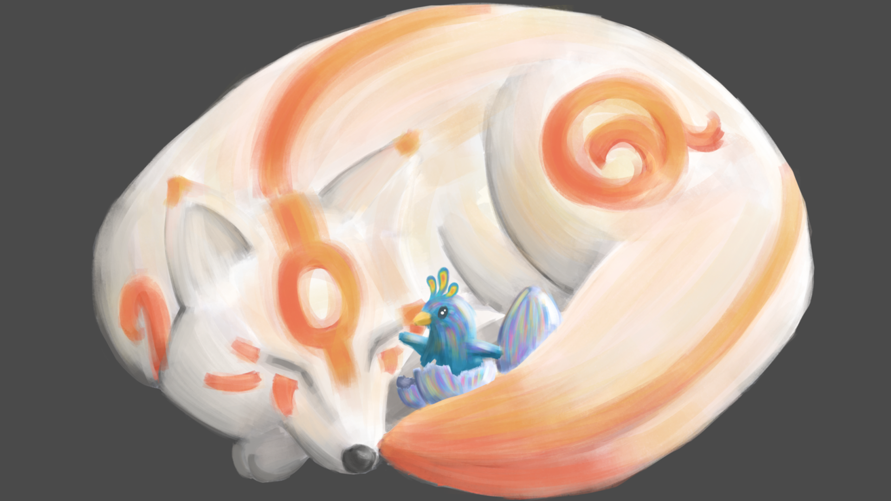

---

<h1> Hi ! I'm Thibaut Unsinger </h1> also known by the username Foxan or <a href="https://profile.intra.42.fr/users/tunsinge">tunsinge<a/>. I am very interested in programmation and computer science in general and i'm currently studying at l'<a href="https://42.fr/en/homepage/">Ecole 42<a/> with a view to working as developper at a later stage.
 

---
# Connect with me

---
# More about me

<picture>
  <source
    srcset="https://github-readme-stats.vercel.app/api?username=thefoxan12&show_icons=true&theme=nord"
    media="(prefers-color-scheme: dark)"
  />
  <source
    srcset="https://github-readme-stats.vercel.app/api?username=thefoxan12&show_icons=true"
    media="(prefers-color-scheme: light), (prefers-color-scheme: no-preference)"
  />
  
</picture>

<picture>
  <source
    srcset="https://github-readme-stats.vercel.app/api/top-langs/?username=thefoxan12&layout=compact&theme=nord"
    media="(prefers-color-scheme: dark)"
  />
  <source
    srcset="https://github-readme-stats.vercel.app/api/top-langs/?username=thefoxan12&layout=compact"
    media="(prefers-color-scheme: light), (prefers-color-scheme: no-preference)"
  />
  
</picture>

 
 

---
# My 42 School Cursus

## 📚 Libft 

## 📘 First Circle
* ### 🖨 Ft_printf 
* ### ⌨️ Get_next_line 
* ### 💾 Born2beroot 

## 📗 Second Circle
* ### 📻 Minitalk 
* ### 🕹 So_long 
* ### 🗃 Push_swap 
* ### 🎓 Exam Rank 02 

## 📒 Third Circle
* ### 🍴 Philosophers 
* ### 🖥 Minishell 
* ### 🎓 Exam Rank 03 

## 📙 Fourth Circle
* ### 🖧 NetPractice 
* ### 📦 Cub3D 
* ### 📋 Modules CPP
  - #### CPP00  
  - #### CPP01   
  - #### CPP02  
  - #### CPP03  
  - #### CPP04  
* ### 🎓 Exam Rank 04 

## 📕 Fifth Circle
* ### 📋 Modules CPP
  - #### CPP05 
  - #### CPP06
  - #### CPP07
  - #### CPP08
  - #### CPP09
* ### 📡 Ft_irc 
* ### 📝 Inception
* ### 🎓 Exam Rank 05

## 📓 Last Circle
* ### 🚀 Ft_transcendence
* ### 🎓 Exam Rank 06
---

